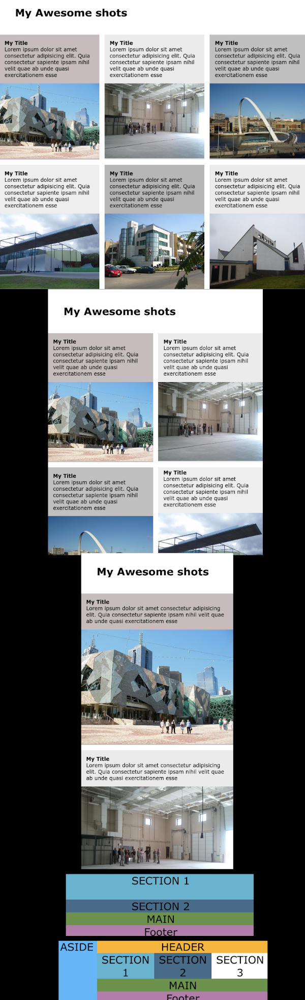

## DESCRIPTION:
- An outline of a site, to play with display grid in css.

## OUTCOME:
Using Display grid with media queries

## TECH STACKS:
- HTML + SASS
- Extension : Live-sass

## PROGRESS:
- Done: 100%

## How to run
`watch sass` (with live-sass)

## View other projects:
- [My Pinterest](https://pin.it/16vGwjy)
- [My Youtube Channel](https://www.youtube.com/channel/UCfkbnM9WvHD3mjecBiGHCBQ/playlists)

## IMAGE:

